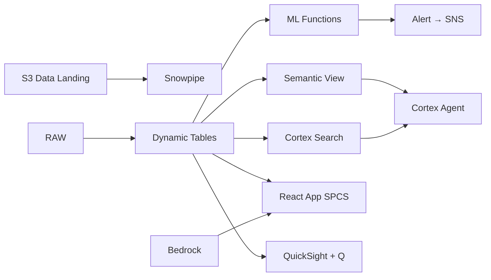

# Food Safety & Quality Compliance

AI-powered food safety compliance for Thailand's ฿3.5T food industry — Textract parses Thai FDA inspection reports, Cortex Search indexes food regulations, and SNS pushes real-time alerts when critical violations are detected.

## Architecture

Thailand exports ฿1.1 trillion in food annually — but 6 of 45 processing facilities are below compliance threshold, generating ฿420M in non-compliance costs. Paper-based inspection tracking and manual regulation lookup mean violations are caught too late. AI-native food safety monitoring closes the gap from weeks to hours.



## Snowflake Capabilities

| Capability | Implementation |
|-----------|---------------|
| Dynamic Tables | FACILITY_COMPLIANCE_SCORE / CCP_DEVIATION_TRENDS / RECALL_RISK_INDEX / REGULATION_COMPLIANCE_GAP |
| ML Functions | ML.FORECAST + ML.ANOMALY_DETECTION |
| Cortex AI | AI_PARSE_DOCUMENT, AI_CLASSIFY, SUMMARIZE |
| Cortex Search | 300 documents indexed |
| Cortex Agent | FOOD_SAFETY_AGENT |
| Semantic View | FOOD_SAFETY_ANALYTICS |
| React App (SPCS) | 5 tabs + DemoGuide |


## AWS Services

| Service | Role in Demo |
|---------|-------------|
| Amazon Textract | Extract structured data from Thai FDA inspection report PDFs (680 docs) |
| Amazon Comprehend | Classify food safety violations by severity from text |
| Amazon Bedrock (Claude) | Generate compliance gap analyses and corrective action recommendations |
| Amazon S3 | Store inspection documents and lab certificates |
| Amazon SNS | Real-time alerts for critical pathogen detections |
| Amazon QuickSight + Q | Food safety compliance dashboard with NL queries |


## Personas

| Persona | Role | Key Questions |
|---------|------|---------------|
| **Dr. Pimchanok Vongsiri** | VP Food Safety & Quality | "What's our overall compliance rate across all facilities?" "Which plants are at highest risk of FDA action?" |
| **Suthep Kruengsakul** | Quality Control Manager | "Which CCPs are showing out-of-spec trends?" "Show me the microbial test results for the shrimp processing line." |


## Data

| Table | Rows | Description |
|-------|------|-------------|
| FACILITIES | 45 | Food processing plants (seafood, chicken, prepared meals, snacks) |
| INSPECTION_REPORTS | 680 | Thai FDA and internal audit inspection reports (parsed PDFs) |
| LAB_RESULTS | 120,000 | Microbial, chemical, and physical test results |
| CCP_MONITORING | 500,000 | HACCP Critical Control Point monitoring data |
| CORRECTIVE_ACTIONS | 4,500 | CAPA records from non-conformances |
| FOOD_REGULATIONS | 300 | Thai FDA regulations, CODEX standards, export market requirements |
| TRACEABILITY | 200,000 | Lot traceability from farm to finished product |
| THAI_FOOD_INDUSTRY | 10 | Thailand food export statistics and industry context |


## Build Instructions

### Prerequisites
- Snowflake account with ACCOUNTADMIN access
- Cortex AI enabled (ML Functions, Search, Agent)
- Warehouse: FOOD_WH (Medium)
- AWS CLI with access (us-west-2)

### Deployment

```bash
snowsql -f snowflake/00_setup.sql
snowsql -f snowflake/01_marketplace_install.sql
snowsql -f snowflake/02_raw_tables.sql
snowsql -f snowflake/03_staging.sql
snowsql -f snowflake/04_dynamic_tables.sql
snowsql -f snowflake/05_search.sql
snowsql -f snowflake/06_ml_models.sql
snowsql -f snowflake/07_semantic_view.sql
snowsql -f snowflake/08_agent.sql
```

### React App (SPCS)
```bash
cd app && npm ci && npm run build
docker build -t aws-thailand-food-safety-app .
docker push bdiqc8sm-default.registry.snowflakecomputing.com/food_safety/app/aws_thailand_food_safety/app:latest
```

### Demo Mode
Open the app URL with `?demo=true` for presenter view.

## Build Modes

### Snowflake Only
Run scripts 00-08 (skip AWS-specific integration). Uses:
- **AI_PARSE_DOCUMENT (native)** instead of Amazon Textract
- **AI_CLASSIFY (native)** instead of Amazon Comprehend
- **Cortex Complete** instead of Amazon Bedrock (Claude)
- **Snowflake Stage + Cortex Search** instead of Amazon S3
- **Alerts + Notification Integration** instead of Amazon SNS
- **Snowflake Intelligence (Cortex Analyst)** instead of Amazon QuickSight + Q

### Full AWS + Snowflake
Run all scripts including AWS integration. Deploy QuickSight dashboard from `quicksight/`.

## Business Impact

Industry research and Snowflake customer outcomes:
- **Thailand's food exports reached ฿1.1 trillion (US$31B) in 2023, ranking 13th globally** — [National Food Institute Thailand](https://www.nfi.or.th/home-eng.php)
- **Food recalls cost manufacturers an average of $10M per event in direct costs alone** — [Food Safety Magazine](https://www.food-safety.com/)
- **AI-powered food safety monitoring reduces critical violations by 40-60%** — [McKinsey Agriculture](https://www.mckinsey.com/industries/agriculture/our-insights)
- **CP Foods (Thailand) processes 15 million chickens daily across its Thai facilities** — [CP Foods](https://www.cpfworldwide.com/en)
- **Kraft Heinz** (Snowflake customer): built a unified data platform on Snowflake powering supply chain and demand forecasting across 200+ brands -- [snowflake.com/customers/kraft-heinz](https://www.snowflake.com/en/customers/all-customers/case-study/kraft-heinz/)

## Key Demo Numbers

- **91.4%** compliance rate (target: 98%) — 6 facilities below threshold
- **฿420M** non-compliance costs this year (recalls, fines, lost contracts)
- **3 pathogen** critical detections in 30 days requiring product holds
- **680 PDFs** inspection reports parsed by AI_PARSE_DOCUMENT
- **500K records** CCP monitoring data points analyzed
- **300 regulations** indexed in Cortex Search (Thai + international)


## License

Apache 2.0 — See [LICENSE](LICENSE) for details.

This is a personal demo project and is not an official Snowflake offering. It comes with no support or warranty.